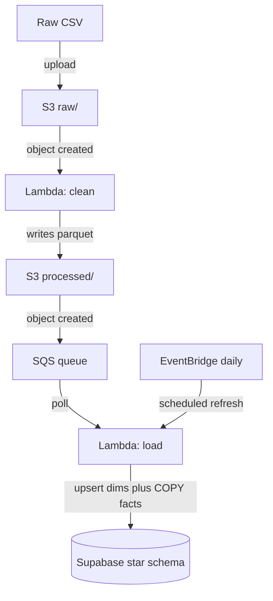

# Architecture

## Flow

1. A CSV uploaded to `s3://<bucket>/raw/` emits an object-created event that
   triggers the clean Lambda.
2. The clean Lambda drops nulls, negative quantities/prices, and cancelled
   orders, then writes a cleaned Parquet to `processed/`.
3. That write emits an event to an SQS queue, which decouples the clean and
   load stages (buffering, retries, dead-letter handling).
4. The load Lambda polls the queue, upserts the three dimensions, resolves
   surrogate keys, and bulk-loads `fact_sales` via `COPY`.
5. A daily EventBridge schedule also invokes the load Lambda to refresh the
   warehouse from the latest processed file.

## Destination

A star schema in Supabase Postgres: `fact_sales` (one row per invoice line)
referencing `dim_customer`, `dim_product`, and `dim_date`, with
`customer_aggregates` exposed as a view over the star. See `sql/schema.sql`.
